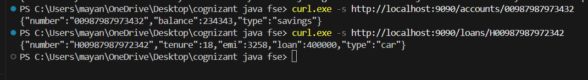

# Week 4: Spring Cloud Microservices (microservices-solutions)

This directory contains the Spring Cloud Microservices solution completed for Week 4 of the Cognizant Java FSE training. The project is organized as a clean Maven multi-module architecture.

## Modules Overview

The project is comprised of a parent configuration and four microservice modules:

1. **`microservices-solutions` (Parent POM)**: Declares Maven properties, Java 17 target, dependency management for Spring Cloud (`2023.0.0`) and Spring Boot (`3.2.2`), and links the submodules.
2. **`eureka-server`**: Netflix Eureka discovery registry server running on port `8761`.
3. **`account-service`**: Microservice providing account lookup capabilities, running on port `8080` and registering with Eureka.
4. **`loan-service`**: Microservice providing loan lookup capabilities, running on port `8081` and registering with Eureka.
5. **`api-gateway`**: Spring Cloud Gateway proxy routing requests, logging incoming URIs through a global filter, and configured with Resilience4j circuit breaker support. Runs on port `9090`.

---

## Restructured Project Tree

```
Week4/
├── pom.xml (Parent Maven POM)
├── README.md (This documentation file)
├── oauth2-jwt-reference.md (Reference doc on OAuth2 Client & Resource Server)
├── gateway-resilience-reference.md (Reference doc on API Gateway, Load Balancing & Resilience)
├── spring_cloud_microservices_win.png (Execution screenshot)
├── eureka-server/
│   ├── pom.xml
│   └── src/main/
│       ├── java/com/digitalnurture/eureka/EurekaServerApplication.java
│       └── resources/application.properties (Port 8761)
├── account-service/
│   ├── pom.xml
│   └── src/main/
│       ├── java/com/digitalnurture/account/
│       │   ├── AccountServiceApplication.java
│       │   └── AccountController.java
│       └── resources/application.properties (Port 8080)
├── loan-service/
│   ├── pom.xml
│   └── src/main/
│       ├── java/com/digitalnurture/loan/
│       │   ├── LoanServiceApplication.java
│       │   └── LoanController.java
│       └── resources/application.properties (Port 8081)
└── api-gateway/
    ├── pom.xml
    └── src/main/
        ├── java/com/digitalnurture/gateway/
        │   ├── ApiGatewayApplication.java
        │   └── LogFilter.java (Global route logging filter)
        └── resources/application.properties (Port 9090, Circuit Breaker)
```

---

## Build and Compilation Instructions

### Prerequisite
Ensure Java 17 or higher and Apache Maven are installed and configured.

### Clean and Build Project
To clean and build all modules in sequence, run the following Maven command from the `Week4` directory:
```powershell
mvn clean package -DskipTests
```

---

## Microservice Architecture & Setup Details

### 1. Eureka Server (`eureka-server`)
- Configured to run on port `8761` via `server.port=8761`.
- Configured to not register with itself:
  ```properties
  eureka.client.register-with-eureka=false
  eureka.client.fetch-registry=false
  ```

### 2. Account Service (`account-service`)
- Registers with Eureka using `eureka.client.service-url.defaultZone=http://localhost:8761/eureka`.
- Exposes GET `/accounts/{number}` returning a Mock Account JSON response containing account type and balance:
  ```json
  {"number":"00987987973432","balance":234343,"type":"savings"}
  ```

### 3. Loan Service (`loan-service`)
- Registers with Eureka using `eureka.client.service-url.defaultZone=http://localhost:8761/eureka`.
- Runs on port `8081` to prevent port conflict with `account-service`.
- Exposes GET `/loans/{number}` returning a Mock Loan JSON response containing loan type, amount, EMI, and tenure:
  ```json
  {"number":"H00987987972342","tenure":18,"emi":3258,"loan":400000,"type":"car"}
  ```

### 4. API Gateway Router (`api-gateway`)
- Runs on port `9090` and retrieves routing locations dynamically from Eureka using `lb://`.
- Implements a global `LogFilter` to log every incoming request's method and URI.
- Configures Resilience4j circuit breaker defaults for fallback handling:
  ```properties
  resilience4j.circuitbreaker.instances.gatewayCircuitBreaker.slidingWindowSize=10
  resilience4j.circuitbreaker.instances.gatewayCircuitBreaker.failureRateThreshold=50
  ```

---

## Verification & Output Screenshot

Verify the microservices by sending GET requests to the API Gateway:
- **Accounts Endpoint**: `curl.exe -s http://localhost:9090/accounts/00987987973432`
- **Loans Endpoint**: `curl.exe -s http://localhost:9090/loans/H00987987972342`


