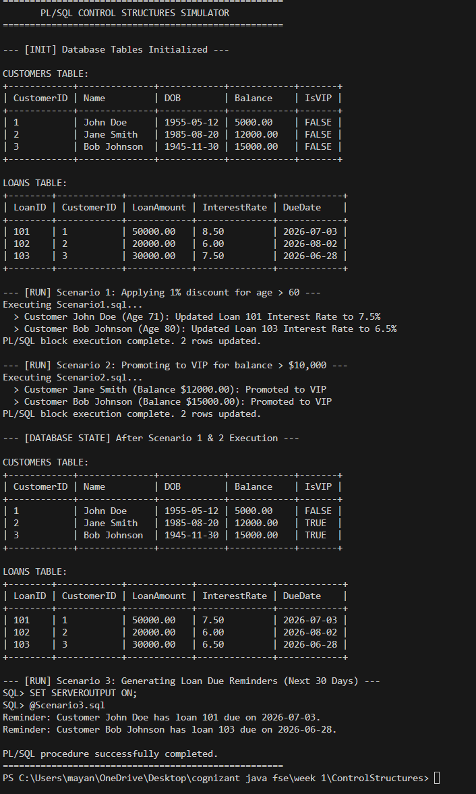

# PL/SQL Control Structures

This project demonstrates the use of PL/SQL control structures (loops, conditional statements, and cursors) to manage customer and loan records in a banking database schema.

## 1. Database Schema

The database consists of two tables: `Customers` and `Loans`.

```sql
CREATE TABLE Customers (
    CustomerID NUMBER PRIMARY KEY,
    Name VARCHAR2(50),
    DOB DATE,
    Balance NUMBER,
    IsVIP VARCHAR2(5) DEFAULT 'FALSE'
);

CREATE TABLE Loans (
    LoanID NUMBER PRIMARY KEY,
    CustomerID NUMBER,
    LoanAmount NUMBER,
    InterestRate NUMBER,
    DueDate DATE,
    FOREIGN KEY (CustomerID) REFERENCES Customers(CustomerID)
);
```

## 2. Scenarios and Implementations

### Scenario 1: Loan Interest Rate Discount
Apply a 1% discount to loan interest rates for customers older than 60 years.

```sql
DECLARE
    v_age NUMBER;
BEGIN
    FOR cust IN (SELECT CustomerID, DOB FROM Customers) LOOP
        v_age := TRUNC(MONTHS_BETWEEN(SYSDATE, cust.DOB) / 12);
        IF v_age > 60 THEN
            UPDATE Loans
            SET InterestRate = InterestRate - 1
            WHERE CustomerID = cust.CustomerID;
        END IF;
    END LOOP;
    COMMIT;
END;
/
```

### Scenario 2: Promote Customers to VIP Status
Set the `IsVIP` flag to `'TRUE'` for all customers with a balance greater than $10,000.

```sql
BEGIN
    FOR cust IN (SELECT CustomerID, Balance FROM Customers) LOOP
        IF cust.Balance > 10000 THEN
            UPDATE Customers
            SET IsVIP = 'TRUE'
            WHERE CustomerID = cust.CustomerID;
        END IF;
    END LOOP;
    COMMIT;
END;
/
```

### Scenario 3: Send Loan Payment Reminders
Fetch all loans due within the next 30 days and print a reminder message for each customer.

```sql
DECLARE
    CURSOR c_due_loans IS
        SELECT c.Name, l.LoanID, l.DueDate
        FROM Loans l
        JOIN Customers c ON l.CustomerID = c.CustomerID
        WHERE l.DueDate BETWEEN SYSDATE AND SYSDATE + 30;
BEGIN
    FOR rec IN c_due_loans LOOP
        DBMS_OUTPUT.PUT_LINE('Reminder: Customer ' || rec.Name || ' has loan ' || rec.LoanID || ' due on ' || TO_CHAR(rec.DueDate, 'YYYY-MM-DD') || '.');
    END LOOP;
END;
/
```

## 3. How to Run
1. Run the `schema.sql` script to create the tables and populate them with seed data.
2. Execute `Scenario1.sql` to apply interest rate discounts.
3. Execute `Scenario2.sql` to update VIP promotions.
4. Enable server output and execute `Scenario3.sql` to print the reminder messages:
   ```sql
   SET SERVEROUTPUT ON;
   @Scenario3.sql
   ```

## 4. Execution Output Screenshot

