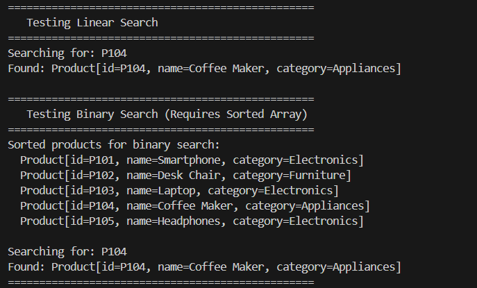

# E-commerce Platform Search Functionality

This project implements and analyzes Linear Search and Binary Search algorithms for an e-commerce product search system.

## 1. Asymptotic Notation (Big O)
* **Big O Notation:** A mathematical representation used to describe the upper bound of an algorithm's running time or space requirement in terms of the input size (N). It allows developers to evaluate efficiency and scalability independently of physical hardware constraints.
* **Scenarios for Search Operations:**
  * **Best Case:** The target element is found immediately on the first comparison.
  * **Average Case:** The target element is located somewhere in the middle, representing the average runtime across all random inputs.
  * **Worst Case:** The target element is at the end of the collection or is missing entirely, forcing the algorithm to run the maximum number of steps.

## 2. Comparison of Search Algorithms

| Algorithm | Best Case | Average Case | Worst Case | Space Complexity | Requirements |
| :--- | :--- | :--- | :--- | :--- | :--- |
| **Linear Search** | O(1) | O(N) | O(N) | O(1) | Works on unsorted arrays. |
| **Binary Search** | O(1) | O(log N) | O(log N) | O(1) | Array **must** be sorted. |

## 3. Platform Suitability Discussion
For an e-commerce platform containing hundreds of thousands of products:
* **Binary Search** is the most suitable algorithm.
* **Why:** Linear search takes time proportional to the number of products (O(N)). Searching a catalog of 1,000,000 products could require up to 1,000,000 checks. Binary search, operating at O(log N), requires a maximum of only 20 checks for the same catalog. Because e-commerce platforms are read-heavy (users search items continuously while the product inventory changes less frequently), the one-time cost of sorting the product array is vastly outweighed by the instantaneous search times provided by binary search.

## 4. Execution Output Screenshot

