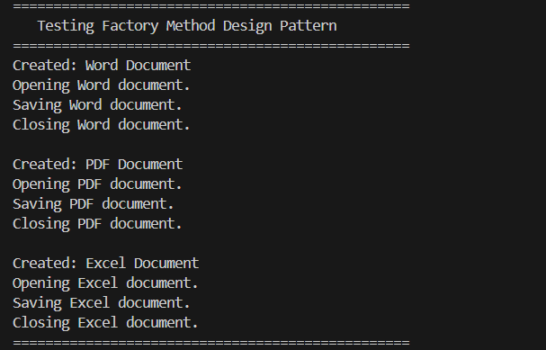

# Factory Method Pattern Example

This project demonstrates the Factory Method Design Pattern by developing a document management system that creates Word, PDF, and Excel documents.

## 1. Scenario
Create a document creation system where the client code interacts with an abstract creator, delegating the instantiation of specific document formats (PDF, Word, Excel) to subclasses.

## 2. How to Compile and Run
Run the following commands in your terminal:
```powershell
javac *.java
java FactoryMethodTest
```

## 3. Execution Output Screenshot

