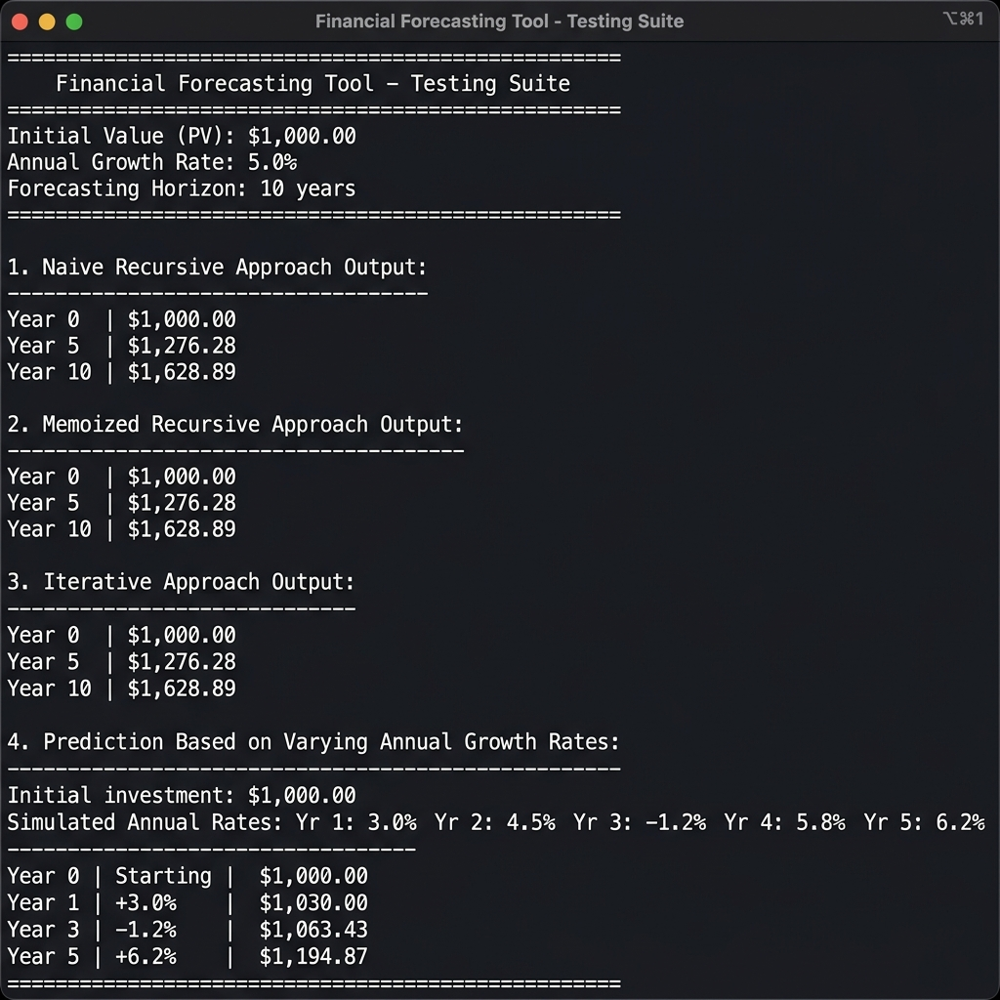

# Financial Forecasting

This project implements and analyzes recursive, memoized, and iterative algorithms for predicting future financial values based on constant or historical growth rates.

## 1. Concept of Recursion
* **Recursion:** A programming and mathematical concept where a method calls itself to solve a smaller instance of the same problem. 
* **Structure:** Every recursive method requires:
  1. **Base Case:** A condition under which the method terminates, preventing infinite loops and stack overflow.
  2. **Recursive Step:** The logic that breaks the main problem into a smaller sub-problem and invokes the method recursively.
* **Simplification:** Recursion simplifies problems that have a naturally recursive structure (e.g., tree traversals, search spaces, or sequential compounding calculations like financial forecasting), allowing developers to write clean, mathematical-like code instead of verbose loops.

## 2. Recursive Algorithm Details
* **Formula:** The future value $FV$ in year $n$ is calculated from the future value of year $n-1$:
  $$FV_n = FV_{n-1} \times (1 + r)$$
  where $r$ is the growth rate.
* **Base Case:** When $n = 0$, the future value is equal to the present value ($PV$):
  $$FV_0 = PV$$

## 3. Complexity Analysis

| Approach | Time Complexity | Space Complexity | Notes / Drawbacks |
| :--- | :--- | :--- | :--- |
| **Naive Recursive** | $O(N)$ | $O(N)$ | Simple to write, but consumes stack memory proportional to the number of periods ($N$). Can result in `StackOverflowError` for large $N$. |
| **Memoized Recursive** | $O(N)$ | $O(N)$ | Avoids redundant calculations if intermediate results are queried repeatedly by caching them, but still carries call stack overhead. |
| **Iterative** | $O(N)$ | $O(1)$ | Loop-based execution with zero recursion call stack overhead. Highly efficient and safe for large values of $N$. |

## 4. Optimization & Avoiding Excessive Computation
To optimize the recursive solution and avoid excessive computation or resource consumption, we use:
1. **Memoization (Dynamic Programming):** We use a cache (e.g., an array or hash map) to store the results of $FV_i$ once they are calculated. If the program queries the forecast for intermediate years multiple times, it fetches the value from the cache in $O(1)$ time rather than recalculating recursively.
2. **Iterative Approach:** By replacing the recursive call stack with a simple `for` loop, we reduce auxiliary space complexity from $O(N)$ to $O(1)$. This prevents `StackOverflowError` and runs faster in practice because it avoids the overhead of method call stack frames.

## 5. Execution Output Screenshot

