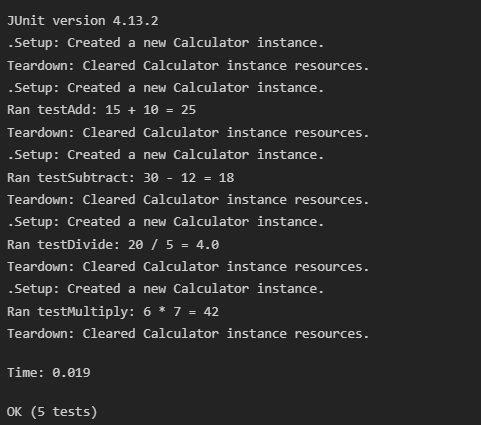

# Exercise 4: Arrange-Act-Assert (AAA) Pattern, Test Fixtures, Setup and Teardown Methods in JUnit

This project demonstrates organizing unit tests using the Arrange-Act-Assert (AAA) pattern and using JUnit `@Before` and `@After` annotations for setup and teardown test fixtures.

## Project Structure

- `pom.xml`: Maven configuration file declaring dependency for JUnit 4.13.2.
- `src/main/java/com/example/Calculator.java`: Simple Java class containing math methods (`add`, `subtract`, `multiply`, `divide`).
- `src/test/java/com/example/CalculatorTest.java`: JUnit test class containing:
  - Setup (`@Before`) and Teardown (`@After`) test fixtures.
  - Test methods organized into Arrange, Act, and Assert stages.
- `run.py`: A simple python runner script to compile and run tests locally.

---

## Code Implementations

### 1. Maven Dependency (`pom.xml`)
```xml
<dependency>
    <groupId>junit</groupId>
    <artifactId>junit</artifactId>
    <version>4.13.2</version>
    <scope>test</scope>
</dependency>
```

### 2. Simple Class (`Calculator.java`)
```java
package com.example;

public class Calculator {
    public int add(int a, int b) { return a + b; }
    public int subtract(int a, int b) { return a - b; }
    public int multiply(int a, int b) { return a * b; }
    public double divide(int a, int b) {
        if (b == 0) throw new IllegalArgumentException("Cannot divide by zero");
        return (double) a / b;
    }
}
```

### 3. Test Cases with Setup, Teardown, and AAA Pattern (`CalculatorTest.java`)
```java
package com.example;

import static org.junit.Assert.assertEquals;
import org.junit.Before;
import org.junit.After;
import org.junit.Test;

public class CalculatorTest {
    private Calculator calculator;

    // Test Fixture Setup: Executed before each test case
    @Before
    public void setUp() {
        // Arrange
        calculator = new Calculator();
        System.out.println("Setup: Created a new Calculator instance.");
    }

    // Test Fixture Teardown: Executed after each test case
    @After
    public void tearDown() {
        calculator = null;
        System.out.println("Teardown: Cleared Calculator instance resources.");
    }

    @Test
    public void testAdd() {
        // Arrange
        int number1 = 15;
        int number2 = 10;

        // Act
        int result = calculator.add(number1, number2);

        // Assert
        assertEquals(25, result);
        System.out.println("Ran testAdd: 15 + 10 = " + result);
    }

    @Test
    public void testSubtract() {
        // Arrange
        int number1 = 30;
        int number2 = 12;

        // Act
        int result = calculator.subtract(number1, number2);

        // Assert
        assertEquals(18, result);
        System.out.println("Ran testSubtract: 30 - 12 = " + result);
    }
}
```

---

## How to Compile and Run

To compile the files and run the JUnit test runner locally from the terminal:
1. Open PowerShell or Command Prompt.
2. Navigate to this project directory:
   ```powershell
   cd "week 1/JUnitArrangeActAssert"
   ```
3. Run the compiler and test runner script:
   ```powershell
   python run.py
   ```

## Output Screenshot


