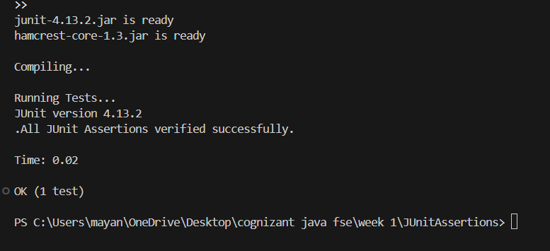

# Exercise 3: Assertions in JUnit

This project demonstrates the use of various assertions in JUnit to validate test results.

## Project Structure

- `pom.xml`: Maven configuration file declaring dependency for JUnit 4.13.2.
- `src/test/java/AssertionsTest.java`: Test class validating several conditions using JUnit assertions.
- `run.py`: Simple compiler and runner script.

---

## Code Implementation

### Solution Code (`AssertionsTest.java`)
```java
import static org.junit.Assert.assertEquals;
import static org.junit.Assert.assertTrue;
import static org.junit.Assert.assertFalse;
import static org.junit.Assert.assertNull;
import static org.junit.Assert.assertNotNull;
import org.junit.Test;

public class AssertionsTest {
    @Test
    public void testAssertions() {
        // Assert equals
        assertEquals(5, 2 + 3);

        // Assert true
        assertTrue(5 > 3);

        // Assert false
        assertFalse(5 < 3);

        // Assert null
        assertNull(null);

        // Assert not null
        assertNotNull(new Object());
    }
}
```

---

## How to Compile and Run

To run the assertions test locally from the terminal:
1. Open PowerShell or Command Prompt.
2. Navigate to this project directory:
   ```powershell
   cd "week 1/JUnitAssertions"
   ```
3. Run the compiler and test runner script:
   ```powershell
   python run.py
   ```

## Output Screenshot


