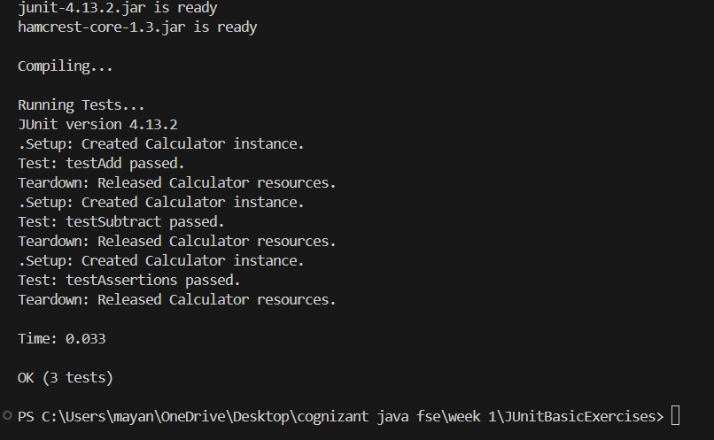

# Exercise: Setting Up and Using JUnit

This project contains simple hands-on exercises for setting up and writing basic unit tests using JUnit 4.

## Project Structure

- `pom.xml`: Maven configuration file declaring dependency for JUnit 4.13.2.
- `src/main/java/com/example/Calculator.java`: Simple Java class containing math methods (`add`, `subtract`, `multiply`, `divide`).
- `src/test/java/com/example/CalculatorTest.java`: JUnit test class implementing:
  - Setup (`@Before`) and Teardown (`@After`) test fixtures.
  - Assertions (`assertEquals`, `assertTrue`, `assertFalse`, `assertNull`, `assertNotNull`).
  - Arrange-Act-Assert (AAA) pattern structure.
- `run.py`: A simple python runner script to compile and run tests locally.

---

## Code Implementations

### 1. Maven Dependency (`pom.xml`)
We add the JUnit dependency to our `pom.xml` as specified:
```xml
<dependency>
    <groupId>junit</groupId>
    <artifactId>junit</artifactId>
    <version>4.13.2</version>
    <scope>test</scope>
</dependency>
```

### 2. Simple Class (`Calculator.java`)
```java
package com.example;

public class Calculator {
    public int add(int a, int b) { return a + b; }
    public int subtract(int a, int b) { return a - b; }
    public int multiply(int a, int b) { return a * b; }
    public double divide(int a, int b) {
        if (b == 0) throw new IllegalArgumentException("Cannot divide by zero");
        return (double) a / b;
    }
}
```

### 3. Test Cases (`CalculatorTest.java`)
```java
package com.example;

import static org.junit.Assert.*;
import org.junit.Before;
import org.junit.After;
import org.junit.Test;

public class CalculatorTest {
    private Calculator calculator;

    @Before
    public void setUp() {
        calculator = new Calculator(); // Arrange
    }

    @After
    public void tearDown() {
        calculator = null;
    }

    @Test
    public void testAdd() {
        int result = calculator.add(10, 5); // Act
        assertEquals(15, result); // Assert
    }

    @Test
    public void testSubtract() {
        int result = calculator.subtract(10, 5); // Act
        assertEquals(5, result); // Assert
    }

    @Test
    public void testAssertions() {
        assertEquals(50, calculator.multiply(10, 5));
        assertTrue(calculator.add(5, 5) > 0);
        assertFalse(calculator.subtract(5, 5) > 0);
        assertNull(null);
        assertNotNull(calculator);
    }
}
```

---

## How to Compile and Run

To compile the files and run the JUnit test runner locally from the terminal:
1. Open PowerShell or Command Prompt.
2. Navigate to this project directory:
   ```powershell
   cd "week 1/JUnitBasicExercises"
   ```
3. Run the compiler and test runner script:
   ```powershell
   python run.py
   ```

## Output Screenshot


