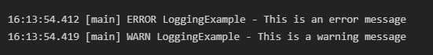

# Exercise 1: Logging Error Messages and Warning Levels (Logging using SLF4J)

This project demonstrates a simple Java application that configures and uses SLF4J and Logback to write logs at the ERROR and WARN levels.

## Project Structure

- `pom.xml`: Maven configuration file declaring dependencies for SLF4J API and Logback Classic.
- `src/main/java/LoggingExample.java`: Java application containing log calls.
- `run.py`: A simple python runner script to compile and run the application locally.

---

## Code Implementations

### 1. Maven Dependencies (`pom.xml`)
```xml
<dependency>
    <groupId>org.slf4j</groupId>
    <artifactId>slf4j-api</artifactId>
    <version>1.7.30</version>
</dependency>
<dependency>
    <groupId>ch.qos.logback</groupId>
    <artifactId>logback-classic</artifactId>
    <version>1.2.3</version>
</dependency>
```

### 2. Java Application (`LoggingExample.java`)
```java
import org.slf4j.Logger;
import org.slf4j.LoggerFactory;

public class LoggingExample {
    private static final Logger logger = LoggerFactory.getLogger(LoggingExample.class);

    public static void main(String[] args) {
        logger.error("This is an error message");
        logger.warn("This is a warning message");
    }
}
```

---

## How to Compile and Run

To compile and run the application locally from the terminal:
1. Open PowerShell or Command Prompt.
2. Navigate to this project directory:
   ```powershell
   cd "week 1/LoggingSLF4J"
   ```
3. Run the compiler and test runner script:
   ```powershell
   python run.py
   ```

## Output Screenshot


