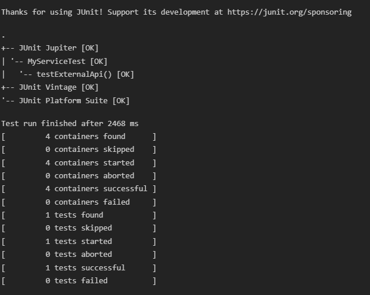

# Exercise 1: Mocking and Stubbing (Mockito Hands-On Exercises)

This project demonstrates how to test a service (`MyService`) that depends on an external API (`ExternalApi`) using Mockito to mock the external API and stub its methods.

## Project Structure

- `pom.xml`: Maven configuration file declaring dependencies for JUnit Jupiter and Mockito.
- `src/main/java/ExternalApi.java`: Dependency interface defining the `getData()` method.
- `src/main/java/MyService.java`: Service class consuming `ExternalApi`.
- `src/test/java/MyServiceTest.java`: JUnit 5 test class mocking the API and stubbing the response to verify functionality.
- `run.py`: A simple python runner script to compile and run tests locally.

---

## Code Implementations

### 1. Maven Dependencies (`pom.xml`)
```xml
<dependency>
    <groupId>org.junit.jupiter</groupId>
    <artifactId>junit-jupiter-api</artifactId>
    <version>5.10.2</version>
    <scope>test</scope>
</dependency>
<dependency>
    <groupId>org.mockito</groupId>
    <artifactId>mockito-core</artifactId>
    <version>5.11.0</version>
    <scope>test</scope>
</dependency>
```

### 2. External API Interface (`ExternalApi.java`)
```java
public interface ExternalApi {
    String getData();
}
```

### 3. Service Class (`MyService.java`)
```java
public class MyService {
    private final ExternalApi externalApi;

    public MyService(ExternalApi externalApi) {
        this.externalApi = externalApi;
    }

    public String fetchData() {
        return externalApi.getData();
    }
}
```

### 4. Test Case with Mocking and Stubbing (`MyServiceTest.java`)
```java
import static org.mockito.Mockito.*;
import static org.junit.jupiter.api.Assertions.assertEquals;
import org.junit.jupiter.api.Test;
import org.mockito.Mockito;

public class MyServiceTest {
    @Test
    public void testExternalApi() {
        // Step 1: Create a mock object for the external API
        ExternalApi mockApi = Mockito.mock(ExternalApi.class);

        // Step 2: Stub the methods to return predefined values
        when(mockApi.getData()).thenReturn("Mock Data");

        // Step 3: Write a test case that uses the mock object
        MyService service = new MyService(mockApi);
        String result = service.fetchData();

        assertEquals("Mock Data", result);
    }
}
```

---

## How to Compile and Run

To compile the files and run the JUnit test runner locally from the terminal:
1. Open PowerShell or Command Prompt.
2. Navigate to this project directory:
   ```powershell
   cd "week 1/MockitoExercises"
   ```
3. Run the compiler and test runner script:
   ```powershell
   python run.py
   ```

## Output Screenshot


