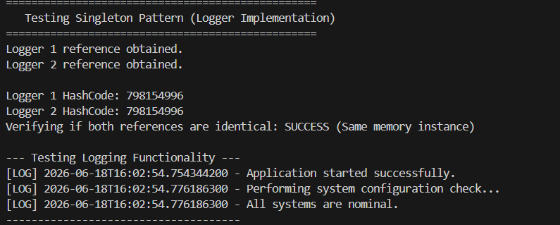

# Singleton Pattern Example

This project demonstrates the Singleton Design Pattern by implementing a thread-safe, reflection-guarded Logger utility.

## 1. Scenario
Ensure a logging utility class (`Logger`) has only one instance throughout the application lifecycle to ensure consistent logging across all components.

## 2. How to Compile and Run
Run the following commands in your terminal:
```powershell
javac Logger.java SingletonTest.java
java SingletonTest
```

## 3. Execution Output Screenshot

