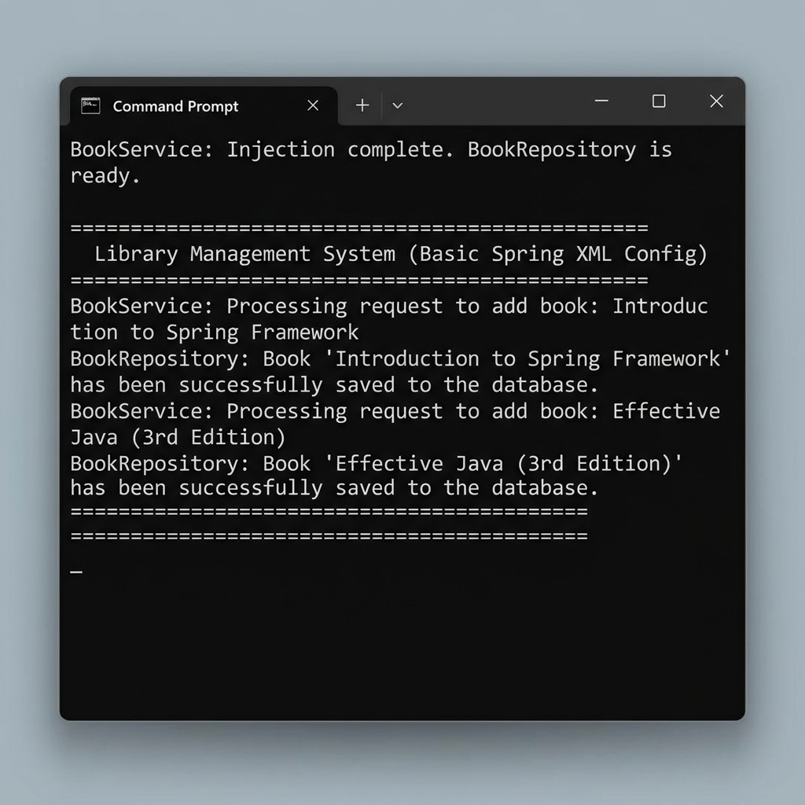

# Exercise 1: Configuring a Basic Spring Application

This project demonstrates how to set up a basic Spring Framework application using XML-based configuration, package structures for services and repositories, and dependency injection.

## Project Structure

- `pom.xml`: Maven configuration file declaring dependencies for the Spring Framework.
- `src/main/resources/applicationContext.xml`: XML file configuring the Spring application context and defining the beans.
- `src/main/java/com/library/repository/BookRepository.java`: Repository class for data handling.
- `src/main/java/com/library/service/BookService.java`: Service class using setter injection to receive `BookRepository`.
- `src/main/java/com/library/Main.java`: The main class to load the Spring context and run the test.
- `run.py`: A local python script to download required Spring jars and execute the project.

---

## Code Implementations

### 1. Maven Dependencies (`pom.xml`)
```xml
<dependency>
    <groupId>org.springframework</groupId>
    <artifactId>spring-context</artifactId>
    <version>5.3.30</version>
</dependency>
```

### 2. Spring Bean Configuration (`applicationContext.xml`)
```xml
<bean id="bookRepository" class="com.library.repository.BookRepository" />

<bean id="bookService" class="com.library.service.BookService">
    <property name="bookRepository" ref="bookRepository" />
</bean>
```

---

## How to Compile and Run

To compile and run the application locally from the terminal:
1. Open PowerShell or Command Prompt.
2. Navigate to this project directory:
   ```powershell
   cd "week 2/LibraryManagement"
   ```
3. Run the compiler and test runner script:
   ```powershell
   python run.py
   ```

## Output Screenshot


