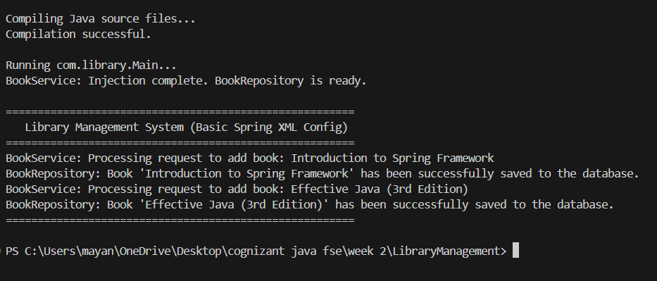

# Exercise 2: Implementing Dependency Injection

This project demonstrates how to implement Dependency Injection (DI) and wire dependencies between components (`BookService` and `BookRepository`) using Spring's IoC container via XML-based configuration.

## Project Structure

- `pom.xml`: Maven configuration file declaring dependencies for the Spring Framework.
- `src/main/resources/applicationContext.xml`: XML file configuring the Spring application context and wiring beans.
- `src/main/java/com/library/repository/BookRepository.java`: Repository class handling data operations.
- `src/main/java/com/library/service/BookService.java`: Service class wired with `BookRepository` using setter injection.
- `src/main/java/com/library/LibraryManagementApplication.java`: Main class to load the Spring context, fetch wired service bean and run the test.
- `run.py`: A local python script to download required Spring jars and execute the project.

---

## Code Implementations

### 1. Maven Dependencies (`pom.xml`)
```xml
<dependency>
    <groupId>org.springframework</groupId>
    <artifactId>spring-context</artifactId>
    <version>5.3.30</version>
</dependency>
```

### 2. Service Setter Method (`BookService.java`)
```java
public class BookService {
    private BookRepository bookRepository;

    // Setter method for setter-based dependency injection
    public void setBookRepository(BookRepository bookRepository) {
        this.bookRepository = bookRepository;
        System.out.println("BookService: Injection complete. BookRepository is ready.");
    }
}
```

### 3. XML Configuration Wiring (`applicationContext.xml`)
```xml
<bean id="bookRepository" class="com.library.repository.BookRepository" />

<bean id="bookService" class="com.library.service.BookService">
    <!-- Wiring the bookRepository bean into the bookService bean -->
    <property name="bookRepository" ref="bookRepository" />
</bean>
```

---

## How to Compile and Run

To compile and run the application locally from the terminal:
1. Open PowerShell or Command Prompt.
2. Navigate to this project directory:
   ```powershell
   cd "week 2/LibraryManagement_DI"
   ```
3. Run the compiler and test runner script:
   ```powershell
   python run.py
   ```

## Output Screenshot


