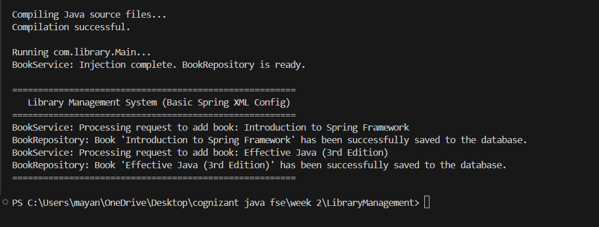

# Exercise 4: Creating and Configuring a Maven Project

This project demonstrates how to set up a new Maven project named `LibraryManagement` and configure Spring Framework dependencies (`spring-context`, `spring-aop`, `spring-webmvc`) along with the Maven Compiler Plugin configured for Java version 1.8.

## Project Structure

- `pom.xml`: Maven configuration file declaring dependencies and build plugin configurations.
- `src/main/java/com/library/LibraryManagementApplication.java`: Simple entry class to verify project compilation and configuration.
- `run.py`: A local python script to handle JAR dependencies download, compile source files, and execute the project.

---

## Maven Configuration (`pom.xml`)

### 1. Spring Dependencies
We have configured:
- `spring-context` (v5.3.30)
- `spring-aop` (v5.3.30)
- `spring-webmvc` (v5.3.30)

### 2. Maven Compiler Plugin
Configured Java compilation source and target versions to `1.8`:
```xml
<plugin>
    <groupId>org.apache.maven.plugins</groupId>
    <artifactId>maven-compiler-plugin</artifactId>
    <version>3.8.1</version>
    <configuration>
        <source>1.8</source>
        <target>1.8</target>
    </configuration>
</plugin>
```

---

## How to Compile and Run

To compile and run the application locally from the terminal:
1. Open PowerShell or Command Prompt.
2. Navigate to this project directory:
   ```powershell
   cd "week 2/LibraryManagement_Maven"
   ```
3. Run the compiler and test runner script:
   ```powershell
   python run.py
   ```

## Output Screenshot


