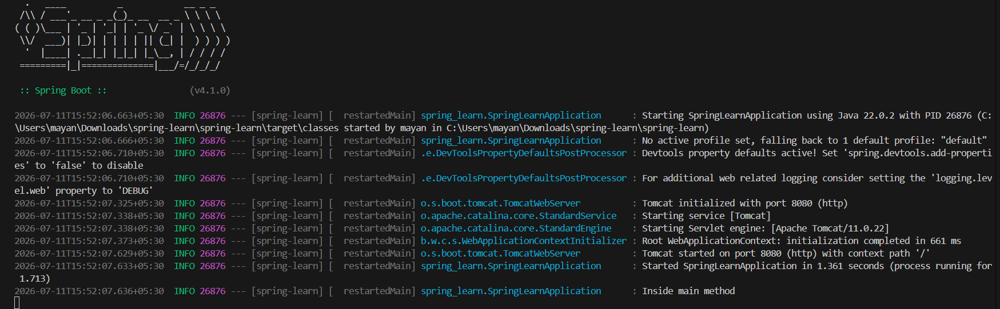

# Week 3: Spring Web Project (spring-learn)

This project demonstrates a basic Spring Boot web application using Spring Web MVC. It includes custom SLF4J logging implemented in the main class (`SpringLearnApplication`) to track application startup and entry.

## Project Structure

- `pom.xml`: Maven configuration file declaring dependencies for Spring Boot Starter Web and DevTools.
- `src/main/java/spring_learn/SpringLearnApplication.java`: Main entry point class that boots the Spring Boot context and logs application startup.
- `src/main/resources/application.properties`: Configuration properties defining application settings such as the application name.
- `spring_learn_win.png`: Screenshot showing the successful build and execution output with the logged messages.

---

## Code Implementations

### 1. Maven Dependencies (`pom.xml`)
```xml
<dependency>
    <groupId>org.springframework.boot</groupId>
    <artifactId>spring-boot-starter-webmvc</artifactId>
</dependency>
<dependency>
    <groupId>org.springframework.boot</groupId>
    <artifactId>spring-boot-devtools</artifactId>
    <scope>runtime</scope>
    <optional>true</optional>
</dependency>
```

### 2. Spring Boot Application (`SpringLearnApplication.java`)
```java
package spring_learn;

import org.slf4j.Logger;
import org.slf4j.LoggerFactory;
import org.springframework.boot.SpringApplication;
import org.springframework.boot.autoconfigure.SpringBootApplication;

@SpringBootApplication
public class SpringLearnApplication {

	private static final Logger LOGGER = LoggerFactory.getLogger(SpringLearnApplication.class);

	public static void main(String[] args) {
		SpringApplication.run(SpringLearnApplication.class, args);
		LOGGER.info("Inside main method");
	}

}
```

---

## How to Compile and Run

To compile and run the application locally from the terminal:
1. Open PowerShell or Command Prompt.
2. Navigate to this project directory:
   ```powershell
   cd "week 3/spring-learn"
   ```
3. Build the project using Maven wrapper:
   ```powershell
   ./mvnw clean package
   ```
4. Run the application:
   ```powershell
   ./mvnw spring-boot:run
   ```

## Output Screenshot


