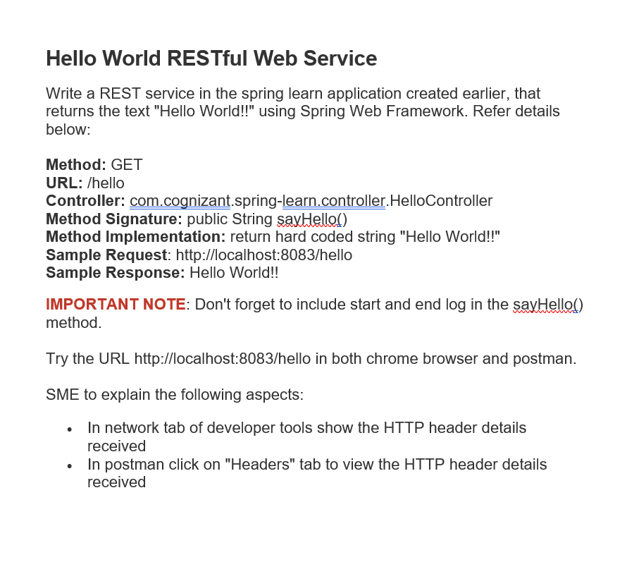
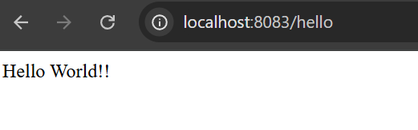
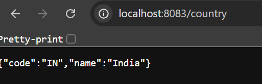

# Week 3: Spring Web & Spring Core Exercises (spring-learn)

This directory contains the exercises completed for Week 3 of the Cognizant Java FSE training, focusing on Spring Boot Web, XML Bean Configuration, Dependency Injection, and custom logging.

## Project Structure

- `pom.xml`: Maven configuration file declaring dependencies for Spring Boot Starter Web and DevTools.
- `src/main/java/spring_learn/SpringLearnApplication.java`: Main entry point class that boots the Spring Boot context, logs application startup, and executes bean lookup.
- `src/main/java/spring_learn/Country.java`: Domain entity representing a Country with SLF4J logging inside its constructor, getters, and setters.
- `src/main/java/spring_learn/controller/HelloController.java`: REST Controller for Exercise 3, mapping GET `/hello`.
- `src/main/java/spring_learn/controller/CountryController.java`: REST Controller for Exercise 4, mapping GET `/country` and loading the Country bean from XML.
- `src/main/resources/country.xml`: Spring XML configuration file defining the `Country` bean.
- `src/main/resources/application.properties`: Configuration properties defining application settings such as the application name, logging levels, and server port.
- `spring_learn_win.png`: Screenshot showing the successful build and execution output of Exercise 1.
- `spring_learn_country_win.png`: Screenshot showing the console logs for Exercise 2 (Country XML configuration loader).
- `spring_learn_rest_win.png`: Screenshot showing the browser response for Exercise 3.
- `spring_learn_country_rest_win.png`: Screenshot showing the browser response for Exercise 4.

---

## Exercise 1: Spring Boot Web Application & Custom Logging

### Description
In this exercise, we initialize a Spring Boot Web MVC application, inspect its Maven configuration, and implement custom SLF4J logging in the main application entry point to print a startup confirmation log.

### Code Implementation (Initial Main Method)
```java
package spring_learn;

import org.slf4j.Logger;
import org.slf4j.LoggerFactory;
import org.springframework.boot.SpringApplication;
import org.springframework.boot.autoconfigure.SpringBootApplication;

@SpringBootApplication
public class SpringLearnApplication {

	private static final Logger LOGGER = LoggerFactory.getLogger(SpringLearnApplication.class);

	public static void main(String[] args) {
		SpringApplication.run(SpringLearnApplication.class, args);
		LOGGER.info("Inside main method");
	}
}
```

### Compile and Run
1. Navigate to the project directory:
   ```powershell
   cd "week 3/spring-learn"
   ```
2. Build the project:
   ```powershell
   ./mvnw clean package
   ```
3. Run the application:
   ```powershell
   ./mvnw spring-boot:run
   ```

### Output Screenshot (Exercise 1)


---

## Exercise 2: Load Country from Spring Configuration XML

### Description
This exercise demonstrates Spring Core XML bean configuration and Property Dependency Injection. A `Country` bean is defined in `country.xml`, loaded into the Spring `ApplicationContext` via `ClassPathXmlApplicationContext`, and retrieved to display the country's details.

### Code Implementation

#### 1. Spring XML Configuration (`src/main/resources/country.xml`)
```xml
<?xml version="1.0" encoding="UTF-8"?>
<beans xmlns="http://www.springframework.org/schema/beans"
       xmlns:xsi="http://www.w3.org/2001/XMLSchema-instance"
       xsi:schemaLocation="http://www.springframework.org/schema/beans
       http://www.springframework.org/schema/beans/spring-beans.xsd">

    <bean id="country" class="spring_learn.Country">
        <property name="code" value="IN" />
        <property name="name" value="India" />
    </bean>

</beans>
```

#### 2. Country Bean Class (`src/main/java/spring_learn/Country.java`)
```java
package spring_learn;

import org.slf4j.Logger;
import org.slf4j.LoggerFactory;

public class Country {
    private static final Logger LOGGER = LoggerFactory.getLogger(Country.class);

    private String code;
    private String name;

    public Country() {
        LOGGER.debug("Inside Country Constructor.");
    }

    public String getCode() {
        LOGGER.debug("Inside getCode Getter.");
        return code;
    }

    public void setCode(String code) {
        LOGGER.debug("Inside setCode Setter: " + code);
        this.code = code;
    }

    public String getName() {
        LOGGER.debug("Inside getName Getter.");
        return name;
    }

    public void setName(String name) {
        LOGGER.debug("Inside setName Setter: " + name);
        this.name = name;
    }

    @Override
    public String toString() {
        return "Country{code='" + code + "', name='" + name + "'}";
    }
}
```

#### 3. Main Application Class (`SpringLearnApplication.java`)
```java
package spring_learn;

import org.slf4j.Logger;
import org.slf4j.LoggerFactory;
import org.springframework.boot.SpringApplication;
import org.springframework.boot.autoconfigure.SpringBootApplication;
import org.springframework.context.ApplicationContext;
import org.springframework.context.support.ClassPathXmlApplicationContext;

@SpringBootApplication
public class SpringLearnApplication {

	private static final Logger LOGGER = LoggerFactory.getLogger(SpringLearnApplication.class);

	public static void main(String[] args) {
		SpringApplication.run(SpringLearnApplication.class, args);
		LOGGER.info("Inside main method");
		displayCountry();
	}

	private static void displayCountry() {
		ApplicationContext context = new ClassPathXmlApplicationContext("country.xml");
		Country country = context.getBean("country", Country.class);
		LOGGER.debug("Country : {}", country.toString());
	}
}
```

### Compile and Run
1. Run the application:
   ```powershell
   ./mvnw spring-boot:run
   ```

### Output Screenshot (Exercise 2)


---

## Exercise 3: Hello World RESTful Web Service

### Description
In this exercise, we write a RESTful web service using Spring Web annotations. The service exposes a GET endpoint at `/hello` on port `8083` and returns the plain text string `"Hello World!!"`. Logging is added to trace the start and end of the handler method execution.

### Code Implementation

#### 1. REST Controller Class (`src/main/java/spring_learn/controller/HelloController.java`)
```java
package spring_learn.controller;

import org.slf4j.Logger;
import org.slf4j.LoggerFactory;
import org.springframework.web.bind.annotation.GetMapping;
import org.springframework.web.bind.annotation.RestController;

@RestController
public class HelloController {
    private static final Logger LOGGER = LoggerFactory.getLogger(HelloController.class);

    @GetMapping("/hello")
    public String sayHello() {
        LOGGER.info("Start sayHello() method");
        String response = "Hello World!!";
        LOGGER.info("End sayHello() method");
        return response;
    }
}
```

#### 2. Server Port Configuration (`src/main/resources/application.properties`)
```properties
spring.application.name=spring-learn
logging.level.spring_learn=DEBUG
server.port=8083
```

### Compile and Run
1. Run the application:
   ```powershell
   ./mvnw spring-boot:run
   ```
2. Navigate to `http://localhost:8083/hello` in a web browser or Postman to request the service.

### Output Screenshot (Exercise 3)


---

## Exercise 4: REST - Country Web Service

### Description
In this exercise, we write a RESTful web service that returns the details of the country "India" as a JSON response. The endpoint is mapped to `/country` and retrieves the `Country` bean from the `country.xml` Spring configuration file.

### Code Implementation

#### 1. REST Controller Class (`src/main/java/spring_learn/controller/CountryController.java`)
```java
package spring_learn.controller;

import org.springframework.context.ApplicationContext;
import org.springframework.context.support.ClassPathXmlApplicationContext;
import org.springframework.web.bind.annotation.RequestMapping;
import org.springframework.web.bind.annotation.RequestMethod;
import org.springframework.web.bind.annotation.RestController;
import spring_learn.Country;

@RestController
public class CountryController {

    @RequestMapping(value = "/country", method = RequestMethod.GET)
    public Country getCountryIndia() {
        ApplicationContext context = new ClassPathXmlApplicationContext("country.xml");
        Country country = context.getBean("country", Country.class);
        return country;
    }
}
```

### Compile and Run
1. Run the application:
   ```powershell
   ./mvnw spring-boot:run
   ```
2. Navigate to `http://localhost:8083/country` in a web browser or Postman.

### Output Screenshot (Exercise 4)


---

## Detailed Explanations (SME Corner)

### 1. Spring XML Bean Configuration Key Concepts
- **`<bean>` tag**: Defines a Java object (bean) that will be managed by the Spring IoC (Inversion of Control) container.
- **`id` attribute**: A unique identifier for the bean in the container context. This ID is used to retrieve the bean using `context.getBean("beanId")`.
- **`class` attribute**: The fully qualified class name of the bean to be instantiated by Spring.
- **`<property>` tag**: Configures dependency injection using setter injection. Spring calls the corresponding setter method on the class to inject the values.
- **`name` attribute**: Specifies the name of the class property (e.g. `code` corresponds to `setCode(String code)`).
- **`value` attribute**: Specifies the literal value to inject into the property.

### 2. ApplicationContext & ClassPathXmlApplicationContext
- **`ApplicationContext`**: The central interface representing the Spring IoC container. It is responsible for instantiating, configuring, and assembling beans, as well as managing their lifecycle.
- **`ClassPathXmlApplicationContext`**: A concrete implementation of `ApplicationContext` that loads configuration definitions from an XML file located on the application classpath (e.g. `src/main/resources/country.xml`).

### 3. What Happens on `context.getBean()`?
When `context.getBean("country", Country.class)` is invoked:
1. **Container Check**: The IoC container checks its internal registry of singleton instances to see if a bean with the ID `"country"` has already been instantiated.
2. **Instance Creation (if singleton not yet instantiated)**:
   - Spring invokes the no-argument constructor of `Country` (logging `"Inside Country Constructor."`).
   - Spring uses reflection to call `setCode("IN")` and `setName("India")` (logging setter operations).
3. **Retrieval**: Since it is scoped as a Singleton (default scope), it returns the fully configured `Country` instance. Subsequent calls will return the same cached instance.

### 4. REST Controller Method & JSON Conversion
- **What happens in the controller method?**
  Inside `getCountryIndia()`, a new `ClassPathXmlApplicationContext` is created which loads `country.xml`. The IoC container parses the XML file, instantiates the `Country` bean (invoking the constructor and setter methods), and registers it. Then, `context.getBean("country", Country.class)` retrieves the bean, and the method returns the `Country` object.
- **How is the bean converted into a JSON response?**
  Spring MVC uses the `HttpMessageConverter` interface to handle object conversion. Because the controller is annotated with `@RestController` (which implicitly applies `@ResponseBody` to all handler methods) and the Jackson library (`jackson-databind`) is present on the classpath (standard with Spring Boot Web), Spring uses `MappingJackson2HttpMessageConverter` to serialize the Java `Country` object into a JSON representation before writing it to the HTTP response body.

### 5. Viewing HTTP Header Details
HTTP headers carry metadata about the request and response in an HTTP transaction. Here is how to view them for the `/hello` and `/country` services:

#### In Chrome Developer Tools (Network Tab):
1. Open Chrome and navigate to `http://localhost:8083/country`.
2. Press `F12` or right-click and choose **Inspect** to open Developer Tools.
3. Switch to the **Network** tab.
4. Refresh the page (`Ctrl + R`).
5. Click on the `country` request entry in the list of network requests.
6. The request details panel will show:
   - **General**: Request URL (`http://localhost:8083/country`), Request Method (`GET`), Status Code (`200 OK`), and Remote Address.
   - **Response Headers**: Metadata sent by the server, such as `Content-Type: application/json` (indicating the output is a JSON object), `Transfer-Encoding: chunked`, and `Date`.
   - **Request Headers**: Metadata sent by the browser to the server, including `Accept`, `User-Agent`, and `Host`.

#### In Postman (Headers Tab):
1. Enter `http://localhost:8083/country` in the URL bar, set the method to `GET`, and click **Send**.
2. Below the response body pane, locate and click the **Headers** tab.
3. This displays the key-value pairs of response headers sent by the Spring application (e.g. `Content-Type`, `Transfer-Encoding`, `Date`, `Keep-Alive`, `Connection`).
