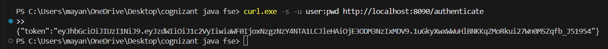

# Week 3: Spring Web & Spring Core Exercises (spring-learn)

This directory contains the exercises completed for Week 3 of the Cognizant Java FSE training, focusing on Spring Boot Web, XML Bean Configuration, Dependency Injection, Custom Logging, Spring Security, and JWT Authentication.

## Project Structure

- `pom.xml`: Maven configuration file declaring dependencies for Spring Boot Starter Web, DevTools, Spring Security, and io.jsonwebtoken library.
- `src/main/java/spring_learn/SpringLearnApplication.java`: Main entry point class that boots the Spring Boot context, logs application startup, and executes bean lookup.
- `src/main/java/spring_learn/Country.java`: Domain entity representing a Country with SLF4J logging inside its constructor, getters, and setters.
- `src/main/java/spring_learn/controller/HelloController.java`: REST Controller for Exercise 3, mapping GET `/hello`.
- `src/main/java/spring_learn/controller/CountryController.java`: REST Controller for Exercise 4 and 5, mapping GET `/country` and GET `/countries/{code}` respectively.
- `src/main/java/spring_learn/controller/AuthController.java`: REST Controller for Exercise 6, mapping GET `/authenticate`.
- `src/main/java/spring_learn/service/CountryService.java`: Service class for Exercise 5, looking up a country by code case-insensitively from the XML bean list.
- `src/main/java/spring_learn/config/SecurityConfig.java`: Security Configuration class configuring JWT service public access.
- `src/main/java/spring_learn/security/JwtUtil.java`: Token Generator Utility class using io.jsonwebtoken.
- `src/main/resources/country.xml`: Spring XML configuration file defining the `Country` beans and list.
- `src/main/resources/application.properties`: Configuration properties defining application settings such as the application name, logging levels, and server port.
- `spring_learn_win.png`: Screenshot showing the successful build and execution output of Exercise 1.
- `spring_learn_country_win.png`: Screenshot showing the console logs for Exercise 2 (Country XML configuration loader).
- `spring_learn_rest_win.png`: Screenshot showing the browser response for Exercise 3.
- `spring_learn_country_rest_win.png`: Screenshot showing the browser response for Exercise 4.
- `spring_learn_countries_win.png`: Screenshot showing the browser response for Exercise 5.
- `spring_learn_jwt_win.png`: Screenshot showing the successful command execution and response of JWT Authentication Service (Exercise 6).

---

## Exercise 1: Spring Boot Web Application & Custom Logging

### Description
In this exercise, we initialize a Spring Boot Web MVC application, inspect its Maven configuration, and implement custom SLF4J logging in the main application entry point to print a startup confirmation log.

### Code Implementation (Initial Main Method)
```java
package spring_learn;

import org.slf4j.Logger;
import org.slf4j.LoggerFactory;
import org.springframework.boot.SpringApplication;
import org.springframework.boot.autoconfigure.SpringBootApplication;

@SpringBootApplication
public class SpringLearnApplication {

	private static final Logger LOGGER = LoggerFactory.getLogger(SpringLearnApplication.class);

	public static void main(String[] args) {
		SpringApplication.run(SpringLearnApplication.class, args);
		LOGGER.info("Inside main method");
	}
}
```

### Compile and Run
1. Navigate to the project directory:
   ```powershell
   cd "week 3/spring-learn"
   ```
2. Build the project:
   ```powershell
   ./mvnw clean package
   ```
3. Run the application:
   ```powershell
   ./mvnw spring-boot:run
   ```

### Output Screenshot (Exercise 1)


---

## Exercise 2: Load Country from Spring Configuration XML

### Description
This exercise demonstrates Spring Core XML bean configuration and Property Dependency Injection. A `Country` bean is defined in `country.xml`, loaded into the Spring `ApplicationContext` via `ClassPathXmlApplicationContext`, and retrieved to display the country's details.

### Code Implementation

#### 1. Spring XML Configuration (`src/main/resources/country.xml`)
```xml
<?xml version="1.0" encoding="UTF-8"?>
<beans xmlns="http://www.springframework.org/schema/beans"
       xmlns:xsi="http://www.w3.org/2001/XMLSchema-instance"
       xsi:schemaLocation="http://www.springframework.org/schema/beans
       http://www.springframework.org/schema/beans/spring-beans.xsd">

    <bean id="country" class="spring_learn.Country">
        <property name="code" value="IN" />
        <property name="name" value="India" />
    </bean>

</beans>
```

#### 2. Country Bean Class (`src/main/java/spring_learn/Country.java`)
```java
package spring_learn;

import org.slf4j.Logger;
import org.slf4j.LoggerFactory;

public class Country {
    private static final Logger LOGGER = LoggerFactory.getLogger(Country.class);

    private String code;
    private String name;

    public Country() {
        LOGGER.debug("Inside Country Constructor.");
    }

    public String getCode() {
        LOGGER.debug("Inside getCode Getter.");
        return code;
    }

    public void setCode(String code) {
        LOGGER.debug("Inside setCode Setter: " + code);
        this.code = code;
    }

    public String getName() {
        LOGGER.debug("Inside getName Getter.");
        return name;
    }

    public void setName(String name) {
        LOGGER.debug("Inside setName Setter: " + name);
        this.name = name;
    }

    @Override
    public String toString() {
        return "Country{code='" + code + "', name='" + name + "'}";
    }
}
```

#### 3. Main Application Class (`SpringLearnApplication.java`)
```java
package spring_learn;

import org.slf4j.Logger;
import org.slf4j.LoggerFactory;
import org.springframework.boot.SpringApplication;
import org.springframework.boot.autoconfigure.SpringBootApplication;
import org.springframework.context.ApplicationContext;
import org.springframework.context.support.ClassPathXmlApplicationContext;

@SpringBootApplication
public class SpringLearnApplication {

	private static final Logger LOGGER = LoggerFactory.getLogger(SpringLearnApplication.class);

	public static void main(String[] args) {
		SpringApplication.run(SpringLearnApplication.class, args);
		LOGGER.info("Inside main method");
		displayCountry();
	}

	private static void displayCountry() {
		ApplicationContext context = new ClassPathXmlApplicationContext("country.xml");
		Country country = context.getBean("country", Country.class);
		LOGGER.debug("Country : {}", country.toString());
	}
}
```

### Compile and Run
1. Run the application:
   ```powershell
   ./mvnw spring-boot:run
   ```

### Output Screenshot (Exercise 2)


---

## Exercise 3: Hello World RESTful Web Service

### Description
In this exercise, we write a RESTful web service using Spring Web annotations. The service exposes a GET endpoint at `/hello` on port `8083` (now `8090` in latest configuration) and returns the plain text string `"Hello World!!"`. Logging is added to trace the start and end of the handler method execution.

### Code Implementation

#### 1. REST Controller Class (`src/main/java/spring_learn/controller/HelloController.java`)
```java
package spring_learn.controller;

import org.slf4j.Logger;
import org.slf4j.LoggerFactory;
import org.springframework.web.bind.annotation.GetMapping;
import org.springframework.web.bind.annotation.RestController;

@RestController
public class HelloController {
    private static final Logger LOGGER = LoggerFactory.getLogger(HelloController.class);

    @GetMapping("/hello")
    public String sayHello() {
        LOGGER.info("Start sayHello() method");
        String response = "Hello World!!";
        LOGGER.info("End sayHello() method");
        return response;
    }
}
```

---

## Exercise 4: REST - Country Web Service

### Description
In this exercise, we write a RESTful web service that returns the details of the country "India" as a JSON response. The endpoint is mapped to `/country` and retrieves the `Country` bean from the `country.xml` Spring configuration file.

### Code Implementation

#### 1. REST Controller Class (`src/main/java/spring_learn/controller/CountryController.java`)
```java
package spring_learn.controller;

import org.springframework.context.ApplicationContext;
import org.springframework.context.support.ClassPathXmlApplicationContext;
import org.springframework.web.bind.annotation.RequestMapping;
import org.springframework.web.bind.annotation.RequestMethod;
import org.springframework.web.bind.annotation.RestController;
import spring_learn.Country;

@RestController
public class CountryController {

    @RequestMapping(value = "/country", method = RequestMethod.GET)
    public Country getCountryIndia() {
        ApplicationContext context = new ClassPathXmlApplicationContext("country.xml");
        Country country = context.getBean("country", Country.class);
        return country;
    }
}
```

---

## Exercise 5: REST - Get Country based on Country Code

### Description
In this exercise, we write a RESTful web service that returns a specific country's details based on its country code path variable (case-insensitive). The country list is configured in `country.xml`, searched via `CountryService` using Java Streams, and exposed via `@GetMapping("/countries/{code}")` in `CountryController`.

### Code Implementation

#### 1. Spring XML Configuration (`src/main/resources/country.xml`)
```xml
<?xml version="1.0" encoding="UTF-8"?>
<beans xmlns="http://www.springframework.org/schema/beans"
       xmlns:xsi="http://www.w3.org/2001/XMLSchema-instance"
       xsi:schemaLocation="http://www.springframework.org/schema/beans
       http://www.springframework.org/schema/beans/spring-beans.xsd">

    <bean id="country" class="spring_learn.Country">
        <property name="code" value="IN" />
        <property name="name" value="India" />
    </bean>

    <bean id="us" class="spring_learn.Country">
        <property name="code" value="US" />
        <property name="name" value="United States" />
    </bean>

    <bean id="de" class="spring_learn.Country">
        <property name="code" value="DE" />
        <property name="name" value="Germany" />
    </bean>

    <bean id="in" class="spring_learn.Country">
        <property name="code" value="IN" />
        <property name="name" value="India" />
    </bean>

    <bean id="jp" class="spring_learn.Country">
        <property name="code" value="JP" />
        <property name="name" value="Japan" />
    </bean>

    <!-- Country List -->
    <bean id="countryList" class="java.util.ArrayList">
        <constructor-arg>
            <list>
                <ref bean="us" />
                <ref bean="de" />
                <ref bean="in" />
                <ref bean="jp" />
            </list>
        </constructor-arg>
    </bean>

</beans>
```

#### 2. Service Class (`src/main/java/spring_learn/service/CountryService.java`)
```java
package spring_learn.service;

import java.util.ArrayList;
import java.util.List;
import org.springframework.context.ApplicationContext;
import org.springframework.context.support.ClassPathXmlApplicationContext;
import org.springframework.stereotype.Service;
import spring_learn.Country;

@Service
public class CountryService {

    @SuppressWarnings("unchecked")
    public Country getCountry(String code) {
        ApplicationContext context = new ClassPathXmlApplicationContext("country.xml");
        List<Country> countries = context.getBean("countryList", ArrayList.class);

        return countries.stream()
                .filter(c -> c.getCode().equalsIgnoreCase(code))
                .findFirst()
                .orElse(null);
    }
}
```

#### 3. Updated REST Controller Class (`src/main/java/spring_learn/controller/CountryController.java`)
```java
package spring_learn.controller;

import org.springframework.beans.factory.annotation.Autowired;
import org.springframework.context.ApplicationContext;
import org.springframework.context.support.ClassPathXmlApplicationContext;
import org.springframework.web.bind.annotation.GetMapping;
import org.springframework.web.bind.annotation.PathVariable;
import org.springframework.web.bind.annotation.RequestMapping;
import org.springframework.web.bind.annotation.RequestMethod;
import org.springframework.web.bind.annotation.RestController;
import spring_learn.Country;
import spring_learn.service.CountryService;

@RestController
public class CountryController {

    @Autowired
    private CountryService countryService;

    @RequestMapping(value = "/country", method = RequestMethod.GET)
    public Country getCountryIndia() {
        ApplicationContext context = new ClassPathXmlApplicationContext("country.xml");
        Country country = context.getBean("country", Country.class);
        return country;
    }

    @GetMapping("/countries/{code}")
    public Country getCountry(@PathVariable("code") String code) {
        return countryService.getCountry(code);
    }
}
```

---

## Exercise 6: Create Authentication Service that returns JWT

### Description
In this exercise, we configure Spring Security and implement a RESTful authentication endpoint `/authenticate` on port `8090`. The controller method reads the HTTP Basic `Authorization` header, decodes the base64-encoded credentials (username and password), and generates a signed JSON Web Token (JWT) using the `jjwt` library.

### Code Implementation

#### 1. Security Config Class (`src/main/java/spring_learn/config/SecurityConfig.java`)
```java
package spring_learn.config;

import org.springframework.context.annotation.Bean;
import org.springframework.context.annotation.Configuration;
import org.springframework.security.config.annotation.web.builders.HttpSecurity;
import org.springframework.security.config.annotation.web.configuration.EnableWebSecurity;
import org.springframework.security.web.SecurityFilterChain;

@Configuration
@EnableWebSecurity
public class SecurityConfig {

    @Bean
    public SecurityFilterChain filterChain(HttpSecurity http) throws Exception {
        http
            .csrf(csrf -> csrf.disable())
            .authorizeHttpRequests(auth -> auth
                .requestMatchers("/authenticate").permitAll()
                .anyRequest().authenticated()
            );
        return http.build();
    }
}
```

#### 2. JWT Utility Class (`src/main/java/spring_learn/security/JwtUtil.java`)
```java
package spring_learn.security;

import io.jsonwebtoken.Jwts;
import io.jsonwebtoken.SignatureAlgorithm;
import io.jsonwebtoken.security.Keys;
import java.security.Key;
import java.util.Date;
import java.util.HashMap;
import java.util.Map;
import org.springframework.stereotype.Component;

@Component
public class JwtUtil {

    private static final Key KEY = Keys.secretKeyFor(SignatureAlgorithm.HS256);
    private static final long EXPIRATION_TIME = 3600000; // 1 hour

    public String generateToken(String username) {
        Map<String, Object> claims = new HashMap<>();
        return Jwts.builder()
                .setClaims(claims)
                .setSubject(username)
                .setIssuedAt(new Date(System.currentTimeMillis()))
                .setExpiration(new Date(System.currentTimeMillis() + EXPIRATION_TIME))
                .signWith(KEY)
                .compact();
    }
}
```

#### 3. Auth Controller Class (`src/main/java/spring_learn/controller/AuthController.java`)
```java
package spring_learn.controller;

import java.util.Base64;
import java.util.HashMap;
import java.util.Map;
import org.slf4j.Logger;
import org.slf4j.LoggerFactory;
import org.springframework.beans.factory.annotation.Autowired;
import org.springframework.http.HttpStatus;
import org.springframework.http.ResponseEntity;
import org.springframework.web.bind.annotation.GetMapping;
import org.springframework.web.bind.annotation.RequestHeader;
import org.springframework.web.bind.annotation.RestController;
import spring_learn.security.JwtUtil;

@RestController
public class AuthController {
    private static final Logger LOGGER = LoggerFactory.getLogger(AuthController.class);

    @Autowired
    private JwtUtil jwtUtil;

    @GetMapping("/authenticate")
    public ResponseEntity<Map<String, String>> authenticate(@RequestHeader(value = "Authorization", required = false) String authHeader) {
        LOGGER.info("Start authenticate method");
        
        if (authHeader == null || !authHeader.startsWith("Basic ")) {
            LOGGER.warn("Missing or invalid Authorization header");
            Map<String, String> errorResponse = new HashMap<>();
            errorResponse.put("error", "Unauthorized");
            return ResponseEntity.status(HttpStatus.UNAUTHORIZED).body(errorResponse);
        }

        try {
            String base64Credentials = authHeader.substring("Basic ".length()).trim();
            byte[] decodedBytes = Base64.getDecoder().decode(base64Credentials);
            String credentials = new String(decodedBytes);
            
            String[] values = credentials.split(":", 2);
            String username = values[0];
            
            LOGGER.info("Decoded username: {}", username);

            String token = jwtUtil.generateToken(username);
            
            Map<String, String> response = new HashMap<>();
            response.put("token", token);
            
            LOGGER.info("End authenticate method");
            return ResponseEntity.ok(response);
        } catch (Exception e) {
            LOGGER.error("Error during decoding credentials", e);
            Map<String, String> errorResponse = new HashMap<>();
            errorResponse.put("error", "Invalid authorization format");
            return ResponseEntity.status(HttpStatus.BAD_REQUEST).body(errorResponse);
        }
    }
}
```

#### 4. Server Port Configuration (`src/main/resources/application.properties`)
```properties
spring.application.name=spring-learn
logging.level.spring_learn=DEBUG
server.port=8090
```

### Compile and Run
1. Run the application:
   ```powershell
   ./mvnw spring-boot:run
   ```
2. Request the service via curl (using `-u` options for HTTP Basic Credentials):
   ```powershell
   curl.exe -s -u user:pwd http://localhost:8090/authenticate
   ```

### Output Screenshot (Exercise 6)


---

## Detailed Explanations (SME Corner)

### 1. Spring XML Bean Configuration Key Concepts
- **`<bean>` tag**: Defines a Java object (bean) that will be managed by the Spring IoC (Inversion of Control) container.
- **`id` attribute**: A unique identifier for the bean in the container context. This ID is used to retrieve the bean using `context.getBean("beanId")`.
- **`class` attribute**: The fully qualified class name of the bean to be instantiated by Spring.
- **`<property>` tag**: Configures dependency injection using setter injection. Spring calls the corresponding setter method on the class to inject the values.
- **`name` attribute**: Specifies the name of the class property (e.g. `code` corresponds to `setCode(String code)`).
- **`value` attribute**: Specifies the literal value to inject into the property.

### 2. ApplicationContext & ClassPathXmlApplicationContext
- **`ApplicationContext`**: The central interface representing the Spring IoC container. It is responsible for instantiating, configuring, and assembling beans, as well as managing their lifecycle.
- **`ClassPathXmlApplicationContext`**: A concrete implementation of `ApplicationContext` that loads configuration definitions from an XML file located on the application classpath (e.g. `src/main/resources/country.xml`).

### 3. What Happens on `context.getBean()`?
When `context.getBean("country", Country.class)` is invoked:
1. **Container Check**: The IoC container checks its internal registry of singleton instances to see if a bean with the ID `"country"` has already been instantiated.
2. **Instance Creation (if singleton not yet instantiated)**:
   - Spring invokes the no-argument constructor of `Country` (logging `"Inside Country Constructor."`).
   - Spring uses reflection to call `setCode("IN")` and `setName("India")` (logging setter operations).
3. **Retrieval**: Since it is scoped as a Singleton (default scope), it returns the fully configured `Country` instance. Subsequent calls will return the same cached instance.

### 4. REST Controller Method & JSON Conversion
- **What happens in the controller method?**
  - **In Exercise 4**: Inside `getCountryIndia()`, a new `ClassPathXmlApplicationContext` is created which loads `country.xml`. The IoC container parses the XML file, instantiates the `Country` bean (invoking the constructor and setter methods), and registers it. Then, `context.getBean("country", Country.class)` retrieves the bean, and the method returns the `Country` object.
  - **In Exercise 5**: When the client calls GET `/countries/{code}`, Spring parses the `{code}` value via `@PathVariable` and calls `countryService.getCountry(code)`. The service loads `country.xml` (which instantiates the list of beans) and retrieves the `countryList` list. A Java Stream filters this list case-insensitively, returning the matching `Country` bean to the controller, which returns it to the client.
- **How is the bean converted into a JSON response?**
  Spring MVC uses the `HttpMessageConverter` interface to handle object conversion. Because the controller is annotated with `@RestController` (which implicitly applies `@ResponseBody` to all handler methods) and the Jackson library (`jackson-databind`) is present on the classpath (standard with Spring Boot Web), Spring uses `MappingJackson2HttpMessageConverter` to serialize the Java `Country` object into a JSON representation before writing it to the HTTP response body.

### 5. JWT Structure & Authentication Concepts
- **How does HTTP Basic Authentication work?**
  When running `curl.exe -u user:pwd`, the curl command encodes `user:pwd` in Base64 format and sends it via the `Authorization` request header as:
  `Authorization: Basic dXNlcjpwd2Q=`
  The backend parses this header, splits it by the prefix `Basic `, decodes `dXNlcjpwd2Q=` back to `user:pwd`, and extracts the username.
- **What is the structure of a JWT?**
  A JSON Web Token consists of three parts separated by dots (`.`):
  1. **Header**: Contains metadata such as the hashing algorithm (`HS256`) and type of token (`JWT`).
  2. **Payload**: Contains claims (subject/username, issuance time `iat`, expiration time `exp`).
  3. **Signature**: Cryptographic signature generated by hashing the header and payload using a secret key (verified on subsequent requests to secure endpoints).
- **SecurityConfig Details**:
  The `SecurityConfig` configuration explicitly disables CSRF (as JWTs are stateless and immune to CSRF) and configures the `/authenticate` endpoint as `permitAll()` to allow new users to authenticate and receive a token.
