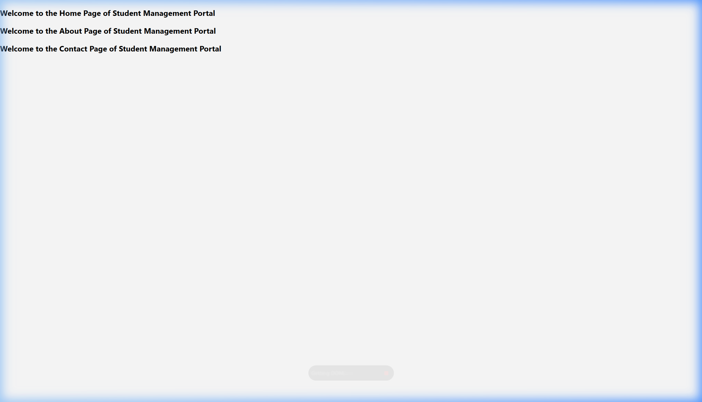

# Week 5 - Exercise 2: Student Management Portal (Multiple Components)

## Objectives & Core Concepts (Short Answers)

### 1. Explain React components
*   **React Components**: Modular, self-contained, and reusable building blocks for constructing user interfaces. They accept inputs (called props) and return React elements describing what should appear on the screen.

### 2. Identify the differences between components and JavaScript functions
*   **React Components**: Must begin with a capital letter (PascalCase), return a React element (JSX), and are instantiated by React to manage state and lifecycle processes.
*   **JavaScript Functions**: Can start with any case, return any JavaScript data type, and are executed manually in code.

### 3. Identify the types of components
*   **Class Components**: ES6 classes extending `React.Component` that must implement a `render()` method.
*   **Function Components**: Simple JavaScript functions accepting `props` as arguments and returning JSX.

### 4. Explain class component
*   A **Class Component** is a component defined using a class structure. It historically held state and lifecycles (like `componentDidMount`), which are defined using methods inside the class.

### 5. Explain function component
*   A **Function Component** is a simpler, more modern component structure. By using React Hooks (like `useState`), function components can handle state and side effects with less boilerplate than class components.

### 6. Define component constructor
*   **Component Constructor**: A method `constructor(props)` that runs when a class component is instantiated. It is used to initialize the component's state (`this.state`) and bind event handler methods to the class instance.

### 7. Define render() function
*   **render()**: The only required method in a React class component. It reads component state/props and returns the JSX markup to represent the UI, which is then drawn to the screen.

---

## Hands-On Lab Outcomes
In this hands-on lab, you will learn how to:
- Create a class component
- Create multiple components
- Render a component

## Output Screenshot

