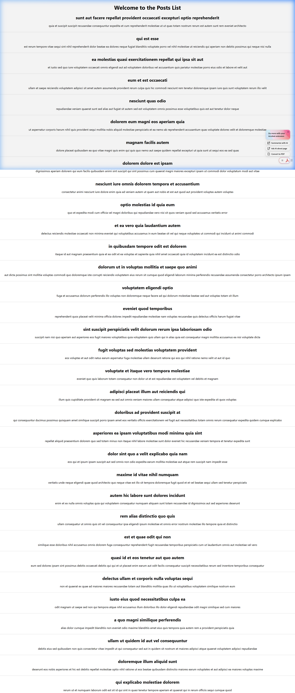

# Week 5 - Exercise 4: Blog Application (Lifecycle Hooks & Fetch API)

## Objectives & Core Concepts (Short Answers)

### 1. Explain the need and benefits of component life cycle
*   **Need**: Web applications require fetching remote data, subscribing to external services, and cleaning up resources (timers, listeners) when pages change.
*   **Benefits**:
    - Predictable control over what code runs at what phase of the component's life (creation, updating, destruction).
    - Prevents memory leaks by cleanups.
    - Simplifies API data integration upon component mounting.

### 2. Identify various life cycle hook methods
*   **`componentDidMount()`**: Runs immediately after the component is rendered in the browser DOM. Best place to initiate API fetch calls, timers, or event listeners.
*   **`componentDidUpdate(prevProps, prevState)`**: Runs after the component's state or props change. Useful for triggering page updates based on changes.
*   **`componentWillUnmount()`**: Runs right before the component is destroyed and removed from the DOM. Essential for cleaning up subscriptions and timers.
*   **`componentDidCatch(error, info)`**: Error boundary method. It catches JS errors anywhere in child components, logs the error, and displays a fallback UI instead of crashing the whole app.

### 3. List the sequence of steps in rendering a component
When a component is mounted, React executes these methods in order:
1.  **`constructor()`**: Initializes state and binds event handlers.
2.  **`getDerivedStateFromProps()`**: Syncs state with changes in incoming props (rarely used).
3.  **`render()`**: Analyzes state/props and outputs JSX representing the UI.
4.  **`componentDidMount()`**: Runs once the component has been successfully placed in the browser DOM.

---

## Hands-On Lab Outcomes
In this hands-on lab, you will learn how to:
- Implement component `componentDidMount()` hook.
- Implement component `componentDidCatch()` life cycle hook.

## Output Screenshot

