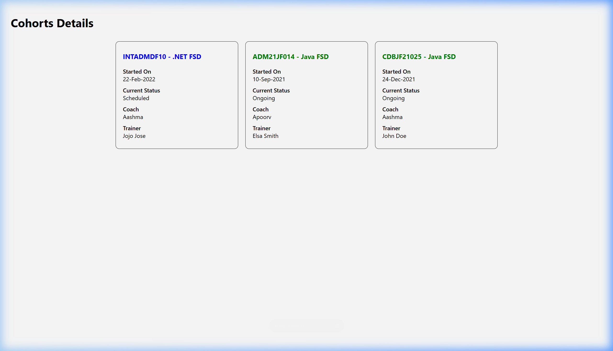

# Week 5 - Exercise 5: Cohort Tracker Dashboard (CSS Modules & Inline Styling)

## Objectives & Core Concepts (Short Answers)

### 1. Understanding the need for styling react component
*   **Need for Styling**: Essential to make interfaces readable, organized, responsive, and professional. In React, styling enables dynamic visual changes (like coloring a heading green when a cohort is "ongoing" and blue for other statuses) to communicate status changes instantly to users.

### 2. Working with CSS Module and inline styles
*   **CSS Modules**: A style sheet where class names are scoped locally to the specific component. It automatically generates unique class names to prevent global namespace collisions.
    - *Example*: Applied using className: `className={styles.box}`.
*   **Inline Styles**: Style properties applied directly inside the element's markup using JavaScript objects. They are ideal for dynamic styling that depends on component state or data values at runtime.
    - *Example*: Applied using style attribute: `style={{ color: status === 'ongoing' ? 'green' : 'blue' }}`.

---

## Hands-On Lab Outcomes
In this hands-on lab, you will learn how to:
- Style a react component.
- Define styles using the CSS Module.
- Apply styles to components using `className` and `style` properties.

## Output Screenshot

