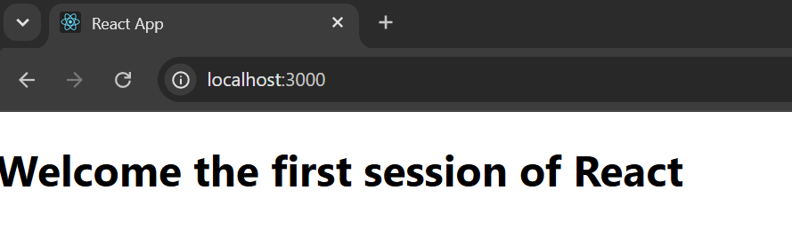

# Week 5 - Exercise 1: My First React Application

## Objectives & Core Concepts (Short Answers)

### 1. Define SPA and its benefits
*   **SPA (Single-Page Application)**: A web application that loads a single HTML document and dynamically updates the content as the user interacts with the app, without reloading the entire page.
*   **Benefits**: Fast page transitions, reduced server load (only JSON data is fetched after initial load), and a smoother, desktop-like user experience.

### 2. Define React and identify its working
*   **React**: A free and open-source front-end JavaScript library developed by Meta (Facebook) for building user interfaces based on components.
*   **Working**: React builds a representation of the user interface (the Virtual DOM) in memory. When state changes occur, React compares the new Virtual DOM with the old one (diffing) and updates only the necessary elements in the actual browser DOM (reconciliation).

### 3. Identify the differences between SPA and MPA
*   **SPA (Single-Page Application)**: 
    - Loads a single HTML file once.
    - Updates UI elements dynamically via AJAX/Fetch.
    - Faster response times after initial load.
*   **MPA (Multi-Page Application)**:
    - Loads a completely new HTML page from the server on every navigation link clicked.
    - Slower transitions due to full-page reloads.
    - Easier search engine optimization (SEO) out-of-the-box.

### 4. Explain Pros & Cons of Single-Page Application
*   **Pros**:
    - High speed and responsiveness.
    - Better user experience.
    - Cached data capabilities.
*   **Cons**:
    - Poor initial page load time (large bundle size).
    - SEO optimization is more complex.
    - Highly dependent on client-side JavaScript execution.

### 5. Explain about React
*   React is a declarative library that makes it easy to create interactive UIs. Design simple views for each state in your application, and React will efficiently update and render just the right components when your data changes.

### 6. Define virtual DOM
*   **Virtual DOM**: A lightweight, virtual representation of the real browser DOM kept in memory. React uses it to track state changes and perform efficient updates to the real DOM, avoiding slow layout recalculations and repaints.

### 7. Explain Features of React
*   **JSX (JavaScript XML)**: Combines HTML-like markup directly inside JavaScript files.
*   **Component-Based Architecture**: UI is split into reusable, self-contained components.
*   **Unidirectional Data Flow**: Data flows one-way from parent to child components via props, making debugging predictable.
*   **Virtual DOM**: Maximizes performance by minimizing direct updates to the browser's DOM.

---

## Hands-On Lab Outcomes
In this hands-on lab, you will learn how to:
- Set up a react environment
- Use create-react-app

## Output Screenshot

