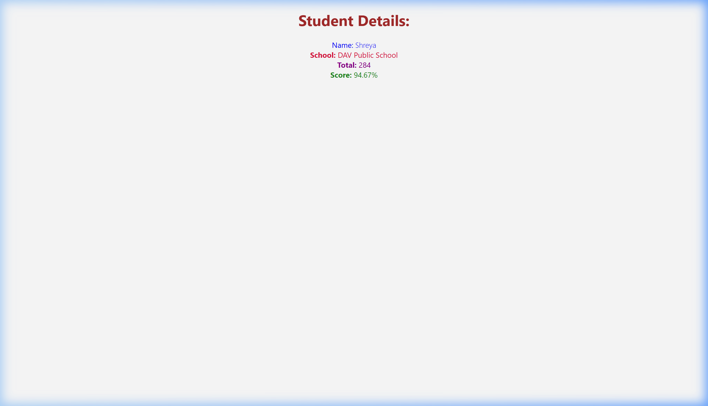

# Week 5 - Exercise 3: Score Calculator Application (Functional Components & Styling)

## Objectives & Core Concepts (Short Answers)

### 1. Explain React components
*   **React Components**: Independent, reusable pieces of code that build user interfaces. They accept input arguments called "props" and return React elements to define the visual layout.

### 2. Identify the differences between components and JavaScript functions
*   **React Components**: Must start with a capital letter (PascalCase), return a React element (JSX), and are mounted and managed by the React framework.
*   **JavaScript Functions**: Can start with any case, return any data type, and are invoked manually in code.

### 3. Identify the types of components
*   **Class Components**: ES6 classes that extend `React.Component` and must implement a `render()` method returning JSX.
*   **Function Components**: Simple JavaScript functions that accept `props` as an argument and return JSX.

### 4. Explain class component
*   A **Class Component** is a component defined using ES6 class syntax. It supports local state and React lifecycle hooks.

### 5. Explain function component
*   A **Function Component** is a component written as a plain JavaScript function. With React Hooks (like `useState`), function components are the preferred and modern way to write React components.

### 6. Define component constructor
*   **Component Constructor**: A method `constructor(props)` that runs when a class component is created. It initializes state (`this.state`) and binds event handler methods to the instance.

### 7. Define render() function
*   **render()**: The only required method in class-based React components. It reads state and props and returns JSX markup describing what to render.

---

## Hands-On Lab Outcomes
In this hands-on lab, you will learn how to:
- Create a function component
- Apply style to components
- Render a component

## Output Screenshot

