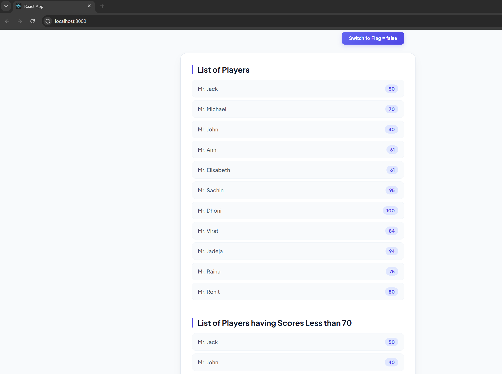

# Week 6 - Exercise 1: Cricket App (ES6 Features in React)

## Objectives & Core Concepts (Short Answers)

### 1. List the features of ES6
- **Arrow Functions**: Concise syntax for writing functions.
- **Classes**: Syntax sugar for prototype-based inheritance.
- **Template Literals**: Multi-line strings and interpolation with `${}`.
- **Destructuring Assignment**: Clean syntax to extract data from arrays and objects.
- **Spread & Rest Operators**: Expand or collect arrays/objects (`...`).
- **Let & Const**: Block-scoped variable declarations.
- **Promises**: Native support for asynchronous programming.
- **Modules**: Built-in import/export syntax.

### 2. Explain JavaScript let
- `let` is a block-scoped variable declaration keyword introduced in ES6. Variables declared with `let` cannot be redeclared in the same scope, and they are not initialized with `undefined` during hoisting (temporal dead zone).

### 3. Identify the differences between var and let
- **Scope**: `var` is function-scoped, whereas `let` is block-scoped.
- **Redeclaration**: `var` variables can be redeclared within their scope; `let` variables will throw a syntax error.
- **Hoisting**: `var` is hoisted and initialized as `undefined`; `let` is hoisted but not initialized.

### 4. Explain JavaScript const
- `const` is a block-scoped declaration used for variables whose values cannot be reassigned after declaration. It must be initialized immediately at the time of declaration. Note that object properties or array elements declared with `const` can still be mutated.

### 5. Explain ES6 class fundamentals
- ES6 classes are templates for creating objects. They encapsulate data (properties) and behavior (methods) in a structured syntax. Under the hood, they use prototype-based inheritance.

### 6. Explain ES6 class inheritance
- ES6 class inheritance allows one class (child class) to inherit properties and methods from another class (parent class) using the `extends` keyword. The subclass constructor must invoke `super()` to call the parent constructor.

### 7. Define ES6 arrow functions
- Arrow functions are a compact syntax for writing JavaScript functions using `=>`. They do not bind their own `this`, `arguments`, `super`, or `new.target`, which makes them ideal for callback functions.

### 8. Identify set(), map()
- **`Set`**: A collection of unique values where duplicate values are automatically discarded.
- **`Map`**: A collection of key-value pairs where keys can be of any data type, preserving insertion order.

---

## Hands-On Lab Outcomes
In this hands-on lab, we learned how to:
- Use the `map()` method of ES6 to render lists of items in React.
- Apply ES6 arrow functions for concise filtering logic.
- Implement ES6 destructuring features (array destructuring) to extract player information.
- Merge arrays using the ES6 spread/merge operator (`[...]`).

## Output Screenshots

### View: Flag = true (List of Players & Score Below 70)

### View: Flag = false (Odd/Even Players & Merged List)

