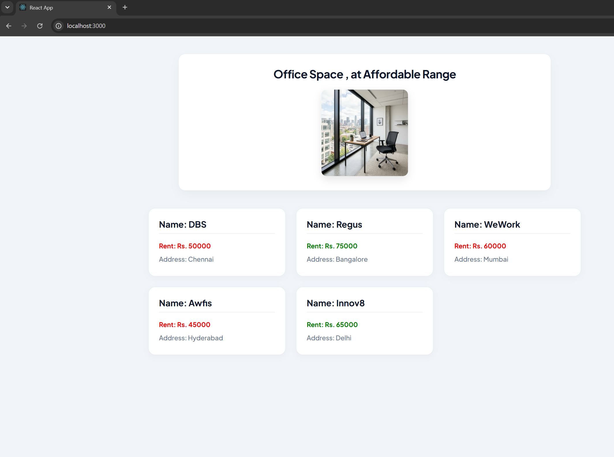

# Week 6 - Exercise 2: Office Space Rental App (JSX & Inline CSS in React)

## Objectives & Core Concepts (Short Answers)

### 1. Define JSX
- **JSX (JavaScript XML)**: A syntax extension to JavaScript used with React. It allows developers to write HTML-like structure directly inside JavaScript code, which is then compiled into regular JavaScript function calls (`React.createElement`).

### 2. Explain about ECMA Script
- **ECMAScript**: The standardized scripting language specification that JavaScript implements. It is managed by Ecma International in the TC39 committee. Standard versions like ES6 (ECMAScript 2015) introduced massive improvements such as classes, arrow functions, modules, `let`/`const`, and destructuring.

### 3. Explain React.createElement()
- **React.createElement()**: The underlying method that React uses to create virtual DOM elements. JSX syntax is compiled into calls of this function: `React.createElement(type, [props], [...children])`.

### 4. Explain how to create React nodes with JSX
- React nodes are created using XML-like tags within JavaScript files. For example, `const element = <h1>Hello</h1>;` creates a React element node that represents an `h1` header.

### 5. Define how to render JSX to DOM
- In React 18+, JSX is rendered to the real DOM by creating a root container using `ReactDOM.createRoot(container)` and then calling the `render(element)` method on that root.

### 6. Explain how to use JavaScript expressions in JSX
- JavaScript expressions can be embedded inside JSX by wrapping them in curly braces `{}`. Any valid JavaScript expression (like variables, operations, or ternary checks) can be placed within these braces.

### 7. Explain how to use inline CSS in JSX
- Inline CSS in JSX is written as a JavaScript object passed to the `style` attribute. Property names are written in camelCase (e.g., `backgroundColor` instead of `background-color`) and values are strings: `<h3 style={{ color: 'red', fontWeight: 'bold' }}>Text</h3>`.

---

## Hands-On Lab Outcomes
In this hands-on lab, we learned how to:
- Use JSX syntax to construct React element hierarchies.
- Apply dynamic inline CSS styling inside JSX using conditional statements (`Rent <= 60000 ? 'red' : 'green'`).
- Display image attributes, declare objects, and loop through an array of objects to render lists in JSX.

## Output Screenshot

